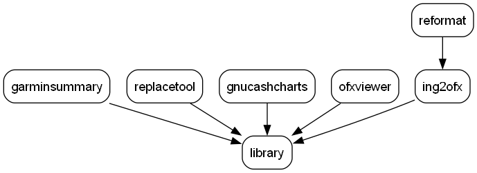

# Prerequisite

Prerequisite for building the projects:

The following tools are used and should be installed in advance:
- _HTML Workshop_ (version 4.74.8702.0), is used for generating and maintaining the Help files (.chm).
- _InnoSetup_ (version 6.4.0), is used for creating the windows installers.

Build projects with command: _mvn clean install_

# Content repository
Aggregator is used by the following projects:

This repository consists of:
- Buildtools, these are a common library for InnoSetup scripts and some script files.
- A JRE which is included in the installer.

# Cheatsheet
Some Maven commands (cheatsheet):
- _mvn clean install_, for building and run tests.
- _mvn versions:display-dependency-updates_, check Dependencies
- _mvn versions:display-plugin-updates_
- _mvn versions:display-parent-updates_
- _mvn versions:use-latest-releases_
- _mvn versions:use-latest-versions_
- _mvn io.github.floverfelt:pom-visualizer-maven-plugin:1.0.0:visualize_
- _mvn com.github.ferstl:depgraph-maven-plugin:aggregate -DcreateImage -Dincludes=kwee_

